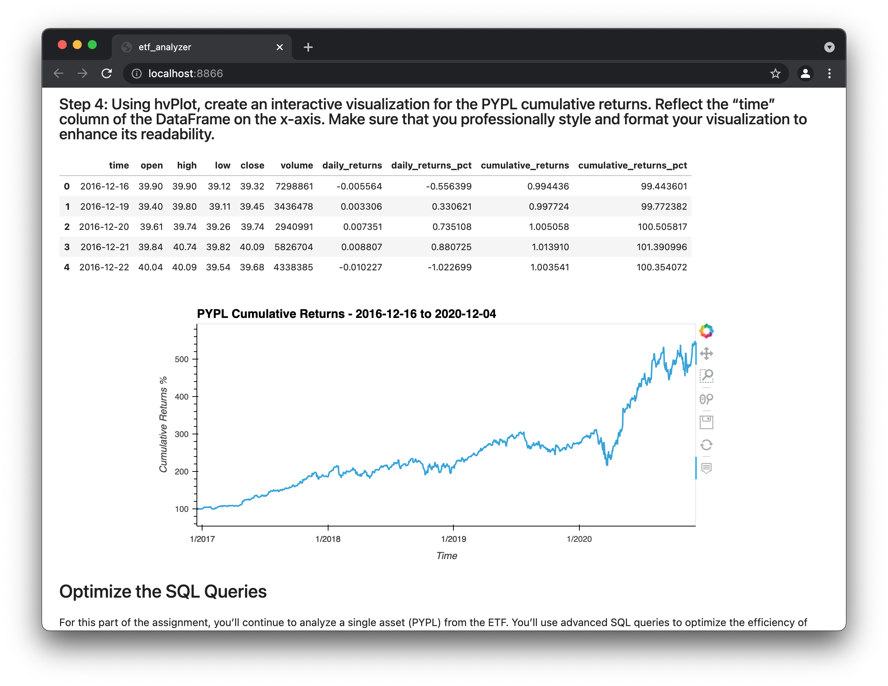

# ETF Analyzer

This Jupyter notebook provides an analysis of ETF returns data stored in an SQL database.

Specifically, it provides:
* An analysis of PYPL (which is a single asset in the ETF), including a DataFrame created from an SQL query of ETF database data, as well as interactive plots of daily and cumulative returns.
* DataFrames of PYPL data created from more advanced SQL queries that optimize data access of the database.
* An analysis of all holdings in the ETF taken together, including a DataFrame created from an SQL query and interactive plots.

The analysis can also be deployed as a web application.

---

## Technologies

This analysis is a Jupyter lab notebook that makes use of the following Python libraries:
* Numpy
* Pandas
* PyViz - hvPlot library
* SQLAlchemy

---

## Installation Guide

To use this notebook:
* Install Jupyter lab Version 2.3.1 and Python 3.7.
* Numpy, Pandas, and SQLAlchemy should already be included in the dev environment distribution.  If not, install them.
* Install PyViz visualization package.
* Install hvPlot version 0.7.0 or later.
* Install NodeJS version 12 or later.

Open the notebook in Jupyter lab and you can rerun the analysis.

---

## Examples

Here are examples of the type of analysis and interactive plots in this notebook, taken from a Voila web application deployment of this notebook:

Here is an example of a DataFrame created from an SQL Inner Join statement, taken from a Voila web application deployment of this notebook:

---

## Contributors

Michael Danenberg

---

## License

MIT